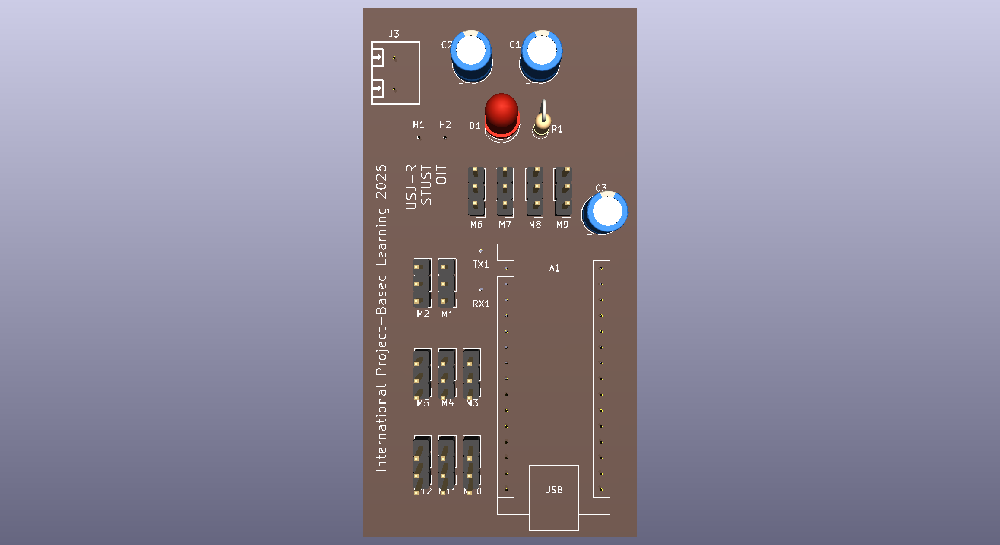
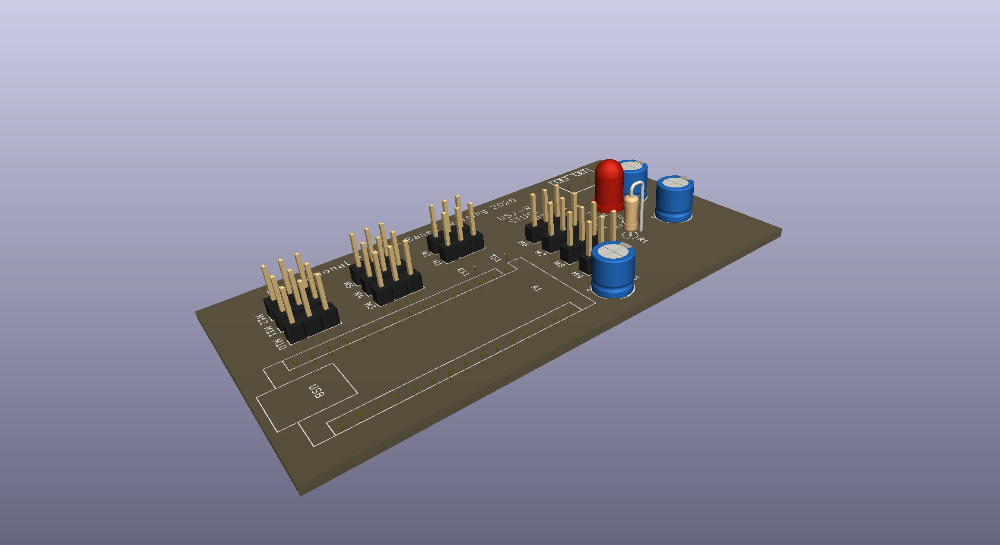
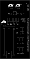
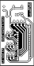
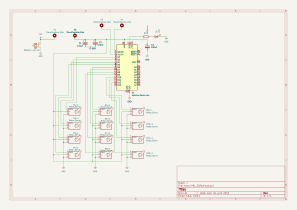

# Nano Quadruped Robot PCB Design - iPBL 2026

A KiCad-based PCB design for servo motor control in a quadruped robot developed for the **International Project Based Learning (iPBL) 2026** program.

| Front | Side |
|-------|------|
|  |  |

## Overview

This project implements a control board for mapping and managing connections to 12 servo motors used in a quadruped robot platform. The board provides power regulation and signal distribution for synchronized leg movement across four legs (3 servos per leg).

## Key Features

- **12 Servo Motor Connections** - Full support for all leg servos (M1-M12)
- **5V Power Regulation** - LM1085-5.0 linear regulator for stable servo power
- **Screw Terminal Connectors** - Easy connection to power and control interfaces
- **Arduino-Compatible** - Compatible with Arduino Nano microcontroller platform
- **Compact Design** - Optimized PCB layout for integration into robot chassis

## Hardware Components

| Reference | Component | Quantity | Purpose |
|-----------|-----------|----------|---------|
| M1-M12 | Servo Motor (Futaba/HiTec/JR connector) | 12 | Motor control for quadruped legs |
| U1-U2 | LM1085-5.0 (5V Regulator) | 2 | Voltage regulation for servo power |
| C1-C4 | Capacitors | 4 | Power supply filtering |
| J1 | Screw Terminal 01x02 | 1 | Power input connector |
| R1 | Resistor | 1 | Current limiting/biasing |
| D1 | Diode | 1 | Reverse polarity protection |
| SW1 | Switch | 1 | Power or reset control |

## Servo Motor Configuration

The 12 servos are organized by quadruped legs:
- **Front Left Leg**: M1, M2, M3
- **Front Right Leg**: M4, M5, M6
- **Rear Left Leg**: M7, M8, M9
- **Rear Right Leg**: M10, M11, M12

## Board Views

Shown inverted (light traces on dark) so they stay readable against GitHub's dark theme.

| Front Silkscreen | Bottom Copper Layer |
|------------------|---------------------|
|  |  |

### Schematic

## Design Specifications

- **PCB Layers**: 2-layer design
- **Pad Drill Size**: Standard 0.4mm
- **Track Width**: 0.25mm (default)
- **Via Diameter**: 0.6mm / 0.4mm drill
- **Design Rules**: Checked for clearance and connectivity

## Files

- `nano_IPBL_2026.kicad_sch` - Schematic design
- `nano_IPBL_2026.kicad_pcb` - PCB layout
- `nano_IPBL_2026.kicad_pro` - KiCad project file
- `nano_IPBL_2026.kicad_prl` - Project runtime library
- `exports/nano_IPBL_2026_schematic.svg` - Full schematic view
- `exports/nano_IPBL_2026-F_Silkscreen.svg` - Front silkscreen view (`*_inverted.svg` for dark backgrounds)
- `exports/nano_IPBL_2026-B_Cu.svg` - Bottom copper layer (`*_inverted.svg` for dark backgrounds)
- `exports/3dview_front.png` / `exports/3dview_side.png` - Expected 3D renders of the board

## Getting Started

### Prerequisites
- KiCad 10.0+ (used for design and editing)
- Compatible microcontroller (Arduino Nano recommended)
- Servo motors with standard 3-wire connectors
- Power supply (typical: 5-6V for servo operation)

### Opening the Project
1. Open KiCad
2. File → Open → Select `nano_IPBL_2026.kicad_pro`
3. Double-click to view the schematic or layout

### Fabrication
- Generate Gerber files from `nano_IPBL_2026.kicad_pcb` for PCB manufacturing
- Use the included design rules for manufacturing tolerances
- Standard 2-layer PCB process compatible

## Power Budget

- **Servo Motor Draw**: ~100-500mA per servo (depending on load)
- **Total Potential Draw**: Up to 6A for all 12 servos
- **Recommended PSU**: 5-6V @ 10A+ for reliable operation

## Notes

- Lock files (.lck) are not included in version control (ignored by .gitignore)
- SVG layer exports provide visual reference of copper traces
- Design includes DRC (Design Rule Check) exclusions for known non-critical issues
- All servo connections use standard 3-wire Futaba/HiTec/JR connectors

## Credits

This design is based on the original [Quadruped Spider Robot (3D Printed Parts, SG90 Servo Motor, Arduino Nano)](https://www.pcbway.com/project/shareproject/Quadruped_Spider_Robot_3D_Printed_Parts_SG90_Servo_Motor_Arduino_Nano_10107fe3.html) project shared on PCBWay. This repository branches off that design with improvements including revised switch/regulator ordering, larger vias and copper pads, and a rearranged component layout.

## License

Part of iPBL 2026 International Project Based Learning Program

---

*Last updated: 2026-07-21*
